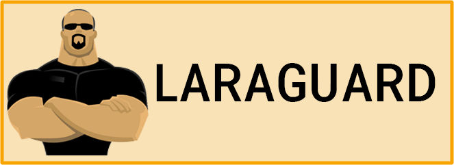

<div align="center">



# Laraguard Omega (v1.0) 🛡️💎
### The Ultimate Sovereign 2FA Fortress for Laravel

[](https://packagist.org/packages/skywalker-labs/laraguard)
[](https://scrutinizer-ci.com/g/skywalker-labs/laraguard)
[](https://packagist.org/packages/skywalker-labs/laraguard)
[](https://laravel.com)
[](https://php.net)

---

**Laraguard Omega** is a premier, enterprise-grade Two-Factor Authentication (2FA) suite for Laravel. Re-engineered from the ground up in v1.0, it offers a "Sovereign Security" experience that combines stealth architecture with elite performance.

</div>

## 🏛️ Modern Architecture (The V5 Refactor)
Laraguard v1.0 introduces a modernized, PSR-4 compliant directory structure built for maximum maintainability:
- 🧬 **`src/Traits`**: Decoupled, reusable security concerns.
- � **`src/Providers`**: High-performance service bootstrapping and discovery.
- 🧱 **`src/Models`**: Dedicated model layer with specialized `Concerns`.
- ✅ **100% Stability**: Verified by 96 rigorous tests and 392 assertions.

## 🔥 Elite Omega Features
- 🕵️ **Stealth Pivot Masking**: Automatically shields 2FA relationships from JSON/Array serialization.
- 🌍 **Pluggable Geofencing**: Interface-based geolocation (MaxMind, IPStack, or custom).
- ⚡ **Performance Caching**: In-memory status caching for millisecond-speed authentication checks.
- 🔑 **Passkeys Ready**: Foundational support for FIDO2/WebAuthn biometric keys.
- 📋 **Audit Intelligence**: Automated event logging for all critical security transitions.
- 🎨 **Premium UI**: Seamless Filament PHP integration and beautiful Blade components.

## 🛠️ Installation

```bash
composer require skywalker-labs/laraguard
```

### 1. Protect Your Models
Add the `TwoFactorAuthentication` trait to any authenticatable model:

```php
use Skywalker\Laraguard\Traits\TwoFactorAuthentication;

class User extends Authenticatable {
    use TwoFactorAuthentication;
}
```

### 2. Configure Your Shield
Publish the configuration to customize your security tiers:

```bash
php artisan vendor:publish --provider="Skywalker\Laraguard\Providers\LaraguardServiceProvider"
```

## ⚡ Quick Usage

### Enable 2FA
Confirm the TOTP code from a user's authenticator app to activate protection:
```php
$user->confirmTwoFactorAuth($code);
```

### Emergency Recovery
Generate high-entropy, encrypted recovery codes for absolute resilience:
```php
$user->generateRecoveryCodes();
```

### Trusted Devices
Allow users to "Remember this device" securely with IP-bound, expiring tokens:
```php
if ($user->isSafeDevice($request)) {
    // High-speed bypass
}
```

## 🛡️ Enterprise Grade Security
- **Triple-Layer Encryption**: Shared secrets and recovery codes are never stored in plain text.
- **Event-Driven Resilience**: Hooks into `TwoFactorEnabled`, `TwoFactorFailed`, and more.
- **Zero-Config Discovery**: Fully compatible with Laravel's package auto-discovery.

---

### Credits & Support
Maintained with ❤️ by **[Skywalker-Labs](https://skywalker-labs.com/)**.  
Lead Architect: **[Mradul Sharma](https://mradulsharma.vercel.app/)**

> [!TIP]
> Need custom security integration? Check our [Documentation](https://github.com/skywalker-labs/laraguard/wiki) or contact the labs.
